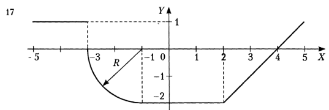
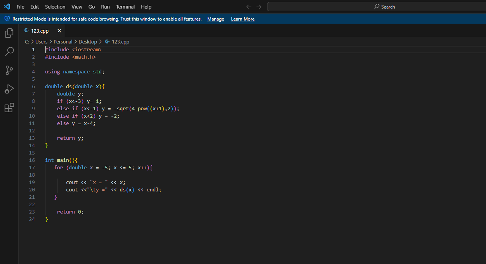

#Лабораторная работа. Разветвляющиеся вычислительные процессы
##Вычисление значений функции
Написать программу, которая по введеномук значению аргумента вычисляет значение функции, заданной в виде графика. Параметр вводится с клавиатуры.

##Код выполненной лабораторной работы

